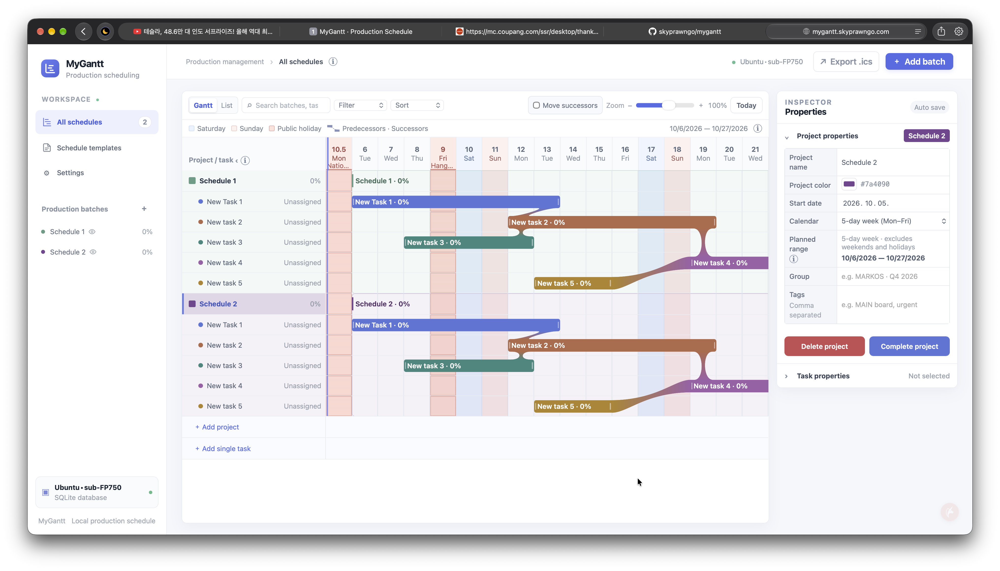
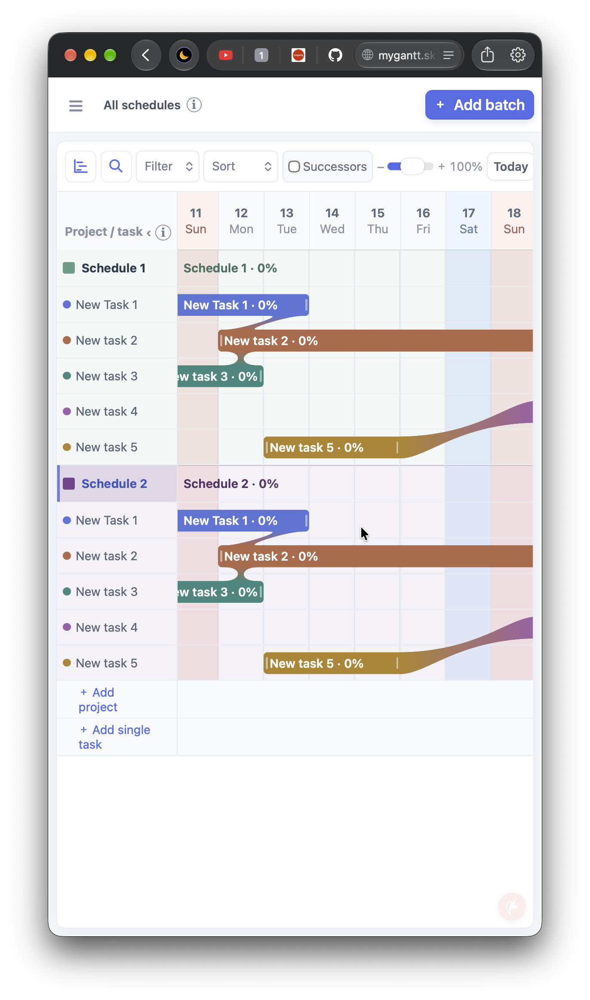
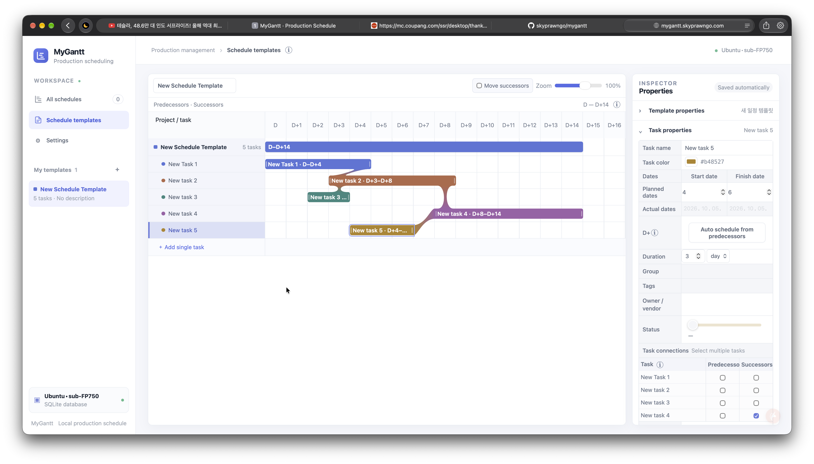

# MyGantt · Production Scheduling

English | [한국어](readme_KR.md)

## Introduction

MyGantt is a web app for managing projects and production batches with an interactive Gantt chart. Turn recurring workflows into schedule templates, then track planned dates, actual dates, and progress in one place.

Built with the Python standard library and SQLite, it requires no package installation or separate database server. Data stays on the computer running the app server, and the interface works in desktop and mobile browsers.

### Desktop overview



### Mobile overview



## Key Features

- **Edit directly on the Gantt chart** — Drag task bars to move schedules or resize either end to change their duration. View planned and actual dates alongside progress, with property edits saved automatically and reflected in the chart.
- **Dependencies and linked schedule adjustments** — Connect multiple predecessors and successors and see their relationships. With “Move successors” enabled, changes to the later of a task’s planned and actual finish shift every linked successor’s planned dates by the same amount. Actual records stay unchanged.
- **Reusable schedule templates** — Save task structures and dependencies, then create independent project schedules from them. Later template edits do not affect existing projects. You can also add individual tasks.
- **Project-focused organization** — Search, filter by status, sort, group, and switch between Gantt and list views. Collapse or hide projects; completed projects fold and move toward the sidebar before being hidden. Select them in the sidebar to show them again.
- **Desktop, mobile, and multilingual UI** — On narrow screens, toggle the menu and property panels to make room for the chart. Choose Korean (KR), English (US), or Japanese (JP) in Settings.
- **Calendar support** — Display weekends and public holidays for your selected country, and export schedules as `.ics` files for external calendar apps. Calendar export is a snapshot, not two-way synchronization.

### Schedule templates

Arrange tasks and predecessor–successor connections on a relative D+ timeline, then reuse the workflow when creating projects.



## Installation and Setup

Install Git and Python 3.12. Python 3.12 is the version used in this project's CI.

### 1. Clone the repository

```sh
git clone https://github.com/skyprawngo/mygantt.git
cd mygantt
```

### 2. Start the server

```sh
python3 -m mygantt.server --host 127.0.0.1 --port 8765
```

### 3. Open the app

Visit [http://127.0.0.1:8765](http://127.0.0.1:8765) in your browser. Press `Ctrl+C` in the server terminal to stop it.

By default, a new database includes a `New schedule template` seed template and example production batches. The seed configuration lives in `mygantt/seed_template.json` and does not overwrite templates or projects in an existing database. To start without examples, add `--no-seed` on the first run. This option does not delete existing data.

```sh
python3 -m mygantt.server --host 127.0.0.1 --port 8765 --no-seed
```

### Data storage and backup

The default database is `data/mygantt.sqlite3` inside the repository. To use another location, add `--db /your/path/mygantt.sqlite3` to the server command.

Stop the server before copying the database for a backup:

```sh
cp data/mygantt.sqlite3 data/mygantt-backup.sqlite3
```

Public holiday lookups use an external API; project and task data are not included in those requests. In Settings, choose South Korea, Japan, the United States, Canada, the United Kingdom, Germany, France, or Australia. The selection applies to all devices using the same server. Only national public holidays are included; state and regional holidays are excluded. New projects using the five-day calendar skip weekends and holidays for the selected country, while the seven-day calendar counts every date. Changing the country does not alter existing task dates.

The default address is accessible only from the computer running the server. For a server accessible from phones and other devices, see the [Ubuntu deployment guide](deploy/ubuntu/README.md).

### Development DB sync (disabled by default)

Optional paired local/server synchronization is separate from normal web-server startup. Both peers require explicit private configuration and SSH authentication. No personal connection settings are included. See [development synchronization](devtools/db-sync/README.md) for setup and disabling instructions.
